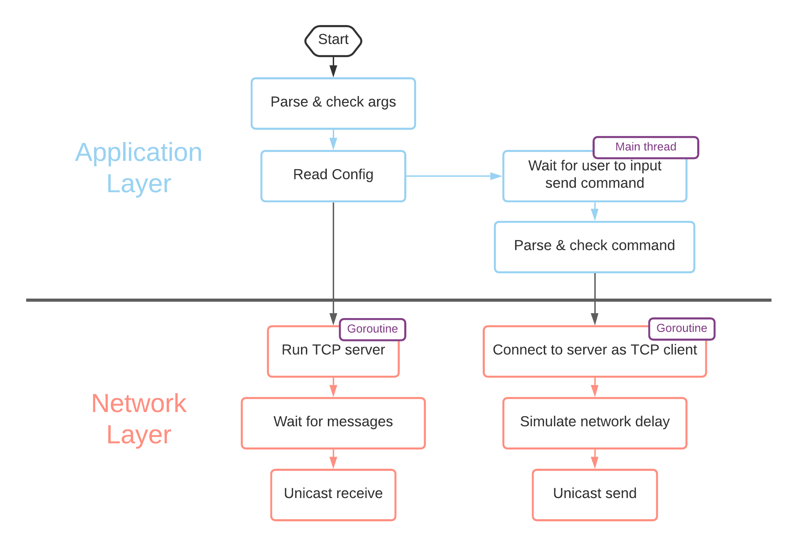

# Spring 2021 Distributed Systems: MP1 #

A network simulation of unicasting delayed messages.

**Author:** [Yicheng Shen](https://github.com/YichengShen)

## To Run ##

You can launch up to 5 processes.

**Step 1:**

For each process, open a terminal and type the following command.

`go run main.go [process ID]`

Please replace `[process ID]` with an integer between 0 and 4. This integer is used to read the configuration file.

**Step 2:**

In each process (terminal), you can do 3 things.

1. Send messages to other processes with the following command

    `send [destination ID] [message]`

2. Wait for messages from other processes (You don't need to type anything)

3. Quit (shutdown the process) by inputting `q`

## Workflow of One Process ##


## Go Structs ##
1. Process
   ```
   type Process struct {
      Id int
      Ip string
      Port string
      MinDelay int
      MaxDelay int
   }
   ```
2. Message
   ```
   type Message struct {       
      Source Process      
      Destination Process      
      Content string       
   }
   ```
   `Source.MinDelay` and `Source.MaxDelay` should not be empty. For the destination process, those two fields can be empty.

## Architecture & Design ##

### Application layer ###
* `main.go` parses the process ID from the command-line arguments. Then, it reads the YAML configuration file based on that process ID.
* In its main thread, it waits for user to input commands for sending messages.

### Network layer ###
* The network layer contains TCP server and client, and the unicast functions which includes the simulation for network delays.
* Each process launches a TCP server.
   * `tcp/server.go` contains functions of starting a server, accepting connections from clients, handling connections, and shutting down the server.
   * The `NewServer` function returns a server that runs in a goroutine.
   * The server keeps waiting for messages sent from other processes and prints out new messages upon receiving.
* In the main thread, upon specific user inputs, the application layer calls the network layer to send new messages.
   * `tcp/client.go` has a `Connect` function to connect to TCP server.
   * `tcp/unicast.go` has functions to simulate the delay and send messages.
      * The unicast functions build upon encoding and decoding in `tcp/utils.go`.

## References ##

1. [Logging](https://dave.cheney.net/2015/11/05/lets-talk-about-logging)

2. [Command-line flags](https://gobyexample.com/command-line-flags)

3. [go-yaml](https://github.com/go-yaml/yaml)

4. [Read yaml file](https://stackoverflow.com/questions/30947534/how-to-read-a-yaml-file)

5. Go package regexp: [Regular expression match string](https://golang.org/pkg/regexp/)

6. [Go package time](https://golang.org/pkg/time/)

7. [Go package rand](https://golang.org/pkg/math/rand/#Intn)